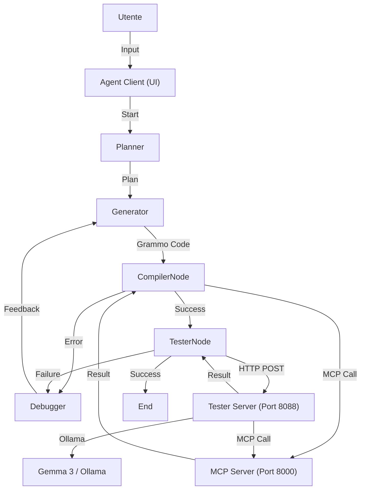

# 📘 Analisi Dettagliata del Codice e dell'Architettura di LILA

Questo documento fornisce una descrizione tecnica approfondita di ogni componente del sistema LILA (Language Interface for Logic Agents), spiegando le scelte architetturali, le librerie utilizzate, i protocolli di comunicazione e le procedure di setup.

---

## 1. Setup dell'Ambiente di Sviluppo

Per garantire la riproducibilità e la corretta esecuzione del sistema LILA, è stato predisposto un file di configurazione dell'ambiente `environment.yml`. Questo file definisce tutte le dipendenze necessarie, sia per Conda che per pip.

### Creazione dell'Ambiente

Per creare l'ambiente virtuale, eseguire il seguente comando nella root del progetto:

```bash
conda env create -f environment.yml
```

Questo comando creerà un ambiente chiamato `lila_env` (o come specificato nel file) con Python 3.10+ e tutte le librerie richieste, tra cui:
- **LangGraph & LangChain**: Per l'orchestrazione degli agenti.
- **FastMCP**: Per l'implementazione del server MCP.
- **Lark**: Per il parsing del linguaggio Grammo.
- **LLVMLite**: Per la compilazione JIT.
- **FastAPI & Uvicorn**: Per i servizi web.

Per attivare l'ambiente:

```bash
conda activate lila_env
```

---

## 2. Panoramica Architetturale

LILA è un sistema multi-agente progettato per generare, compilare, testare e correggere codice in un linguaggio proprietario chiamato **Grammo**. L'architettura è modulare e distribuita, basata su tre pilastri principali:

1.  **Orchestrator & Agents (Client)**: Il cervello del sistema, implementato con **LangGraph**. Gestisce il flusso di lavoro tra Planner, Generator, Tester e Debugger.
2.  **MCP Server (Model Context Protocol)**: Un server che espone gli strumenti "fisici" (compilatore, analizzatore sintattico, runner di test) agli agenti AI in modo standardizzato.
3.  **Tester Server (Agent-to-Agent Service)**: Un microservizio dedicato che ospita l'agente di testing (basato su modelli locali come Gemma 3 o GPT-OSS) per disaccoppiare il carico di lavoro e permettere l'uso di modelli specializzati.

### Diagramma di Flusso Logico



---

## 3. Struttura del Progetto e Analisi Dettagliata dei Componenti

### Cartella `agents/` (Logica Agenti)

Questa cartella contiene il cuore pulsante del sistema LILA. Ogni file rappresenta un componente specifico dell'architettura a agenti.

#### `agent_client.py` (Interfaccia Utente)
*   **Ruolo**: Punto di ingresso (Entry Point) per l'utente.
*   **Tecnologia**: Utilizza la libreria `rich` per creare un'interfaccia a riga di comando (CLI) moderna, con supporto per colori, tabelle e spinner di caricamento.
*   **Funzionalità Chiave**:
    *   **Inizializzazione**: Configura il grafo di LangGraph importando `build_graph` da `multi_agent.py`.
    *   **Gestione Sessione**: Mantiene lo stato della conversazione e gestisce l'input dell'utente.
    *   **Streaming**: Visualizza in tempo reale gli eventi emessi dal grafo (es. "Planner sta pensando...", "Generator ha prodotto codice...").
    *   **Selezione Modello**: Permette di configurare quale LLM utilizzare (es. Gemini 3, GPT-4, ecc.) tramite variabili d'ambiente o configurazione diretta.

#### `multi_agent.py` (Definizione del Grafo)
*   **Ruolo**: Definisce la `StateGraph` (macchina a stati) di LangGraph che orchestra l'interazione tra gli agenti.
*   **Struttura dello Stato (`AgentState`)**:
    *   `messages`: Lista dei messaggi della conversazione.
    *   `task`: Il compito corrente da eseguire.
    *   `plan`: Il piano generato dal Planner.
    *   `code`: Il codice Grammo generato.
    *   `errors`: Eventuali errori di compilazione o test.
    *   `iterations`: Contatore per evitare loop infiniti.
*   **Logica del Grafo**:
    *   Definisce i nodi: `planner`, `generator`, `compiler`, `tester`, `debugger`.
    *   Definisce gli archi condizionali (Conditional Edges):
        *   Da `compiler` a `tester` se la compilazione ha successo.
        *   Da `compiler` a `debugger` se la compilazione fallisce.
        *   Da `tester` a `debugger` se i test falliscono.
        *   Da `debugger` a `generator` per applicare le correzioni.

#### `orchestrator.py` (Router e Coordinamento)
*   **Ruolo**: Gestisce la logica di routing iniziale e il coordinamento generale.
*   **Funzioni Chiave**:
    *   `router_node`: Analizza l'input dell'utente per decidere se invocare il Planner (per nuovi task complessi) o passare direttamente al Generator (per modifiche semplici).
    *   `check_tester_service`: Verifica periodicamente se il `Tester Server` è attivo e raggiungibile, garantendo la robustezza del sistema.

#### `planner.py` (Agente Pianificatore)
*   **Ruolo**: Scompone problemi complessi in passaggi logici.
*   **Logica**:
    *   Utilizza un prompt di sistema (`MAKE_PLAN_SYSTEM_PROMPT`) che istruisce l'LLM a pensare passo dopo passo.
    *   **Parsing Robusto**: Include funzioni come `_parse_plan_json` per estrarre il piano strutturato dall'output dell'LLM, gestendo vari formati (JSON, liste numerate).
    *   **Revisione**: Supporta un ciclo di feedback con l'utente per raffinare il piano prima di passare alla generazione del codice.

#### `generator.py` (Agente Generatore)
*   **Ruolo**: Traduce il piano in codice Grammo eseguibile.
*   **Logica**:
    *   È fortemente tipizzato e istruito sulla sintassi specifica di Grammo (es. dichiarazione funzioni `func int -> nome`, I/O con `>>` e `<<`).
    *   Utilizza strumenti (`tools`) definiti tramite LangChain/LangGraph:
        *   `grammo_lark`: Per una validazione sintattica rapida prima della compilazione completa.
        *   `grammo_compile`: Per tentare la compilazione reale.
    *   Gestisce lo stato `GeneratorState` per tracciare i tentativi di compilazione e gli errori.

#### `tester.py` & `tester_server.py` (Agente di Testing Distribuito)
*   **Ruolo**: Genera ed esegue casi di test per validare il codice.
*   **Architettura A2A (Agent-to-Agent)**:
    *   `tester.py`: Contiene la logica dell'agente, i prompt per la generazione dei test e l'uso del tool `run_grammo_tests`.
    *   `tester_server.py`: Un wrapper **FastAPI** che espone la logica di `tester.py` come servizio web.
*   **Vantaggi**:
    *   **Isolamento**: Il testing può girare su hardware dedicato o in un container separato.
    *   **Modelli Locali**: Permette l'uso efficiente di modelli locali (es. Gemma 3 via Ollama) per generare test case massivi senza costi API.
*   **Tool `run_grammo_tests`**: Chiama il server MCP per eseguire fisicamente il codice Grammo contro i casi di test generati.

#### `debugger_evaluator.py` (Agente di Correzione)
*   **Ruolo**: Analizza errori e propone fix.
*   **Logica**:
    *   Riceve in input il codice originale, l'errore (dal compilatore o dai test) e il piano originale.
    *   Utilizza un prompt specializzato (`DEBUGGER_EVALUATOR_SYSTEM`) per diagnosticare la causa radice (es. errore di sintassi, logica errata, tipo non corrispondente).
    *   Genera una versione corretta del codice o istruzioni dettagliate per il Generator.
    *   Implementa un meccanismo di "retry" limitato per evitare loop infiniti di correzione.

#### `mcp_client.py` (Client MCP)
*   **Ruolo**: Interfaccia di comunicazione con il server MCP.
*   **Tecnologia**: Usa `fastmcp.Client` per gestire la connessione HTTP/SSE con il server MCP.
*   **Funzioni**:
    *   `grammo_compiler_mcp`: Invia codice al server per la compilazione.
    *   `grammo_lark_mcp`: Invia codice per il controllo sintattico.
    *   `grammo_test_mcp`: Invia codice e test case per l'esecuzione.
    *   Gestisce la normalizzazione delle risposte JSON-RPC.

### Cartella `mcp/` (Server degli Strumenti)

Questa cartella implementa il "backend fisico" del sistema, esponendo le capacità del compilatore Grammo tramite il protocollo MCP.

#### `server.py` (Server MCP)
*   **Ruolo**: Server che implementa il protocollo Model Context Protocol.
*   **Tecnologia**: `FastMCP`.
*   **Tools Esposti**:
    1.  `grammo_lark`: Wrapper attorno al parser Lark. Veloce, non richiede compilazione LLVM.
    2.  `grammo_compiler`: Invoca la pipeline completa di compilazione.
    3.  `grammo_test`: Esegue il codice compilato in memoria (JIT) contro input specifici.
*   **Configurazione**: Gira tipicamente sulla porta 8000.

#### `grammo/` (Implementazione del Linguaggio)
Questa sottocartella contiene l'implementazione vera e propria del linguaggio Grammo.
*   **`lex_syntax/grammo.lark`**: File di grammatica EBNF che definisce la sintassi del linguaggio. Usato da Lark per generare il parser.
*   **`semantic/`**: Moduli per l'analisi semantica (controllo dei tipi, risoluzione dei nomi, verifica dello scope). Costruisce l'AST (Abstract Syntax Tree).
*   **`codegen/`**:
    *   `code_generator.py`: Visita l'AST e genera codice intermedio LLVM (IR) usando `llvmlite`.
    *   `execution.py`: Gestisce l'esecuzione JIT (Just-In-Time) del codice LLVM generato.

---

## 4. Librerie Chiave e Scelte Tecniche

### 1. LangGraph & LangChain
*   **Scelta**: LangGraph è stato scelto per la sua capacità di gestire flussi ciclici (loop di correzione) e stato persistente, essenziale per il pattern "Generator -> Error -> Debugger -> Generator".
*   **Utilizzo**: Definisce il grafo degli agenti in `multi_agent.py`.

### 2. FastMCP (Model Context Protocol)
*   **Scelta**: MCP è uno standard emergente per connettere LLM a strumenti esterni.
*   **Vantaggio**: Disaccoppia l'implementazione del tool (il compilatore) dall'agente. Se domani cambiamo l'agente da Gemini a Claude, il server MCP rimane identico.
*   **Implementazione**: `mcp/server.py` usa `FastMCP` per creare rapidamente server compatibili.

### 3. FastAPI
*   **Scelta**: Usato in `tester_server.py`. È lo standard de facto per API Python moderne, performante e con validazione automatica (Pydantic).
*   **Utilizzo**: Espone l'agente Tester come un microservizio REST.

### 4. Lark
*   **Scelta**: Parser library per Python. Scelta per la sua facilità d'uso e potenza nel definire grammatiche EBNF.
*   **Utilizzo**: Parsing del codice Grammo in un albero sintattico (AST).

### 5. LLVM (via llvmlite)
*   **Scelta**: Backend di compilazione industriale.
*   **Utilizzo**: Grammo non è interpretato, ma compilato in IR (Intermediate Representation) ed eseguito JIT (Just-In-Time), garantendo performance reali.

### 6. Rich
*   **Scelta**: Libreria per interfacce terminale.
*   **Utilizzo**: Rende l'output dell'agente leggibile, con colori, tabelle e pannelli, migliorando la UX dello sviluppatore.

---

## 5. Protocolli di Comunicazione

### MCP (Model Context Protocol)
*   **Tipo**: JSON-RPC (Remote Procedure Call) su HTTP (in questa implementazione specifica, spesso MCP usa stdio, ma qui è adattato su HTTP/SSE).
*   **Flusso**:
    1.  Client invia: `{"jsonrpc": "2.0", "method": "tools/call", "params": {"name": "grammo_compiler", "arguments": {"code": "..."}}}`
    2.  Server esegue la funzione Python `compiler()`.
    3.  Server risponde: `{"jsonrpc": "2.0", "result": {"content": [{"type": "text", "text": "Compilation successful..."}]}}`

### HTTP REST (Agent-to-Agent)
*   **Endpoint**: `POST http://localhost:8088/invoke`
*   **Payload**: JSON definito da modelli Pydantic (`A2ARequest`).
*   **Scopo**: Permette all'agente principale (Orchestrator) di delegare il task di testing a un sottosistema autonomo.

---

## 6. Walkthrough di una Richiesta Utente

1.  **Input**: L'utente digita "Crea una calcolatrice".
2.  **Planner**: Riceve l'input. Consulta il prompt di sistema e genera un piano: "1. Definire funzioni per somma, sottrazione... 2. Creare un loop nel main...".
3.  **Generator**: Riceve il piano. Usa il modello LLM (es. Gemini 3) per tradurre il piano in codice Grammo, rispettando la sintassi `func int -> ...`.
4.  **Compiler Node**:
    *   Chiama `mcp_client.grammo_compiler(code)`.
    *   Il client contatta `localhost:8000`.
    *   Il server MCP parsa il codice con Lark. Se OK, genera LLVM IR.
    *   Ritorna "Success" o errori di sintassi.
5.  **Decisione**:
    *   Se **Errore**: Il grafo passa il controllo al **Debugger**. Il Debugger legge l'errore, modifica il codice e lo rimanda al Compiler.
    *   Se **Successo**: Il grafo passa al **Tester**.
6.  **Tester Node**:
    *   Invia il codice a `localhost:8088` (Tester Server).
    *   Il Tester Server usa Ollama (Gemma 3) per generare casi di test (es. "input: 5, 3 -> output atteso: 8").
    *   Esegue i test chiamando nuovamente il server MCP (`grammo_test`).
    *   Ritorna il report dei test.
7.  **Output**: L'utente vede il risultato finale sulla CLI.

---

## 7. Dettagli sui Modelli AI

### Gemini 3 Pro / Flash
*   Usati per la logica principale (Planner, Generator, Debugger).
*   Scelti per la loro capacità di seguire istruzioni complesse e gestire finestre di contesto ampie (necessarie per mantenere in memoria la specifica del linguaggio Grammo).

### Gemma 3 27b (Locale)
*   Usato per il Tester.
*   Scelto per dimostrare la capacità ibrida Cloud/Locale. Essendo un modello locale, riduce i costi API per operazioni ripetitive come la generazione di test case.
*   **Nota Tecnica**: Poiché Gemma 3 ha peculiarità nel gestire i prompt di sistema, LILA implementa una logica di "patching" che fonde le istruzioni di sistema nel primo messaggio utente.
*   **Configurazione di Test**: I test di validazione del sistema sono stati eseguiti utilizzando **Gemma 3** come modello locale per il Tester Server, con l'agente di test configurato per operare in modalità autonoma (disaccoppiato dal flusso principale se necessario).

---

## 8. Riferimenti e Crediti

Il linguaggio **Grammo** e la sua documentazione originale sono stati creati da **Salvatore Di Martino**. Per dettagli specifici sulla sintassi e le specifiche originali, fare riferimento a:

*   **Repository Grammo**: [https://github.com/saldm04/Grammo](https://github.com/saldm04/Grammo)
*   **Documentazione Ufficiale**: [https://github.com/saldm04/Grammo/tree/main/Documents](https://github.com/saldm04/Grammo/tree/main/Documents)
*   **Profilo Autore**: [https://github.com/saldm04](https://github.com/saldm04)
